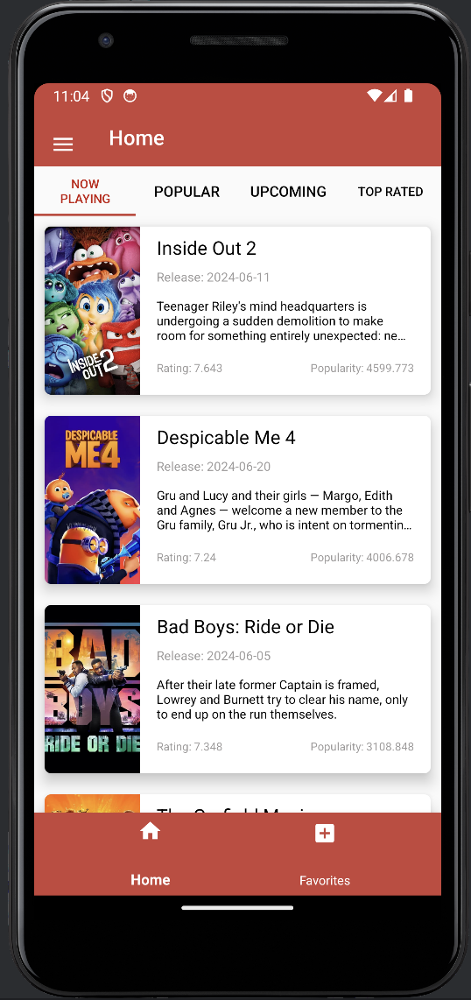
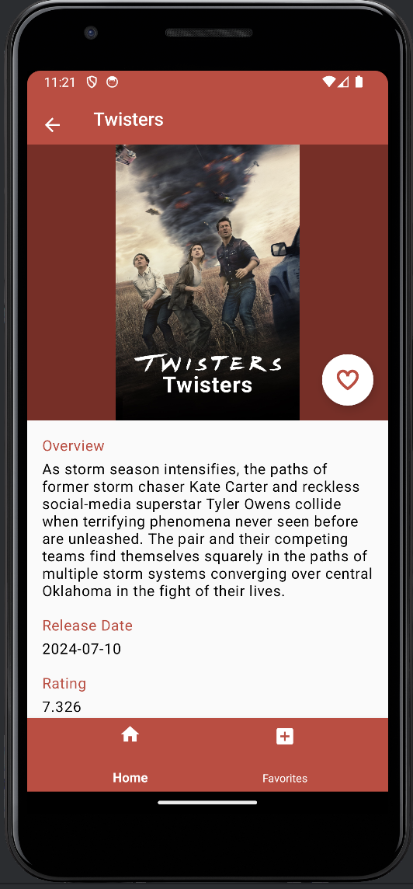
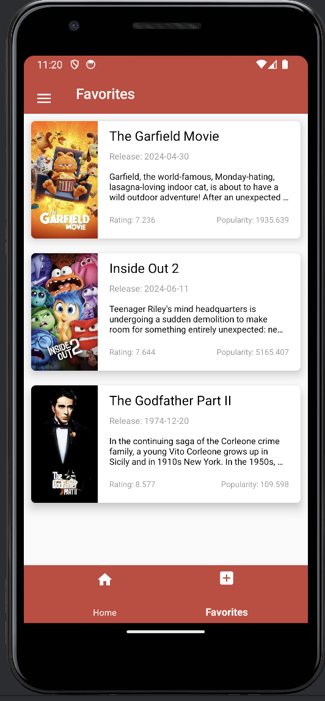
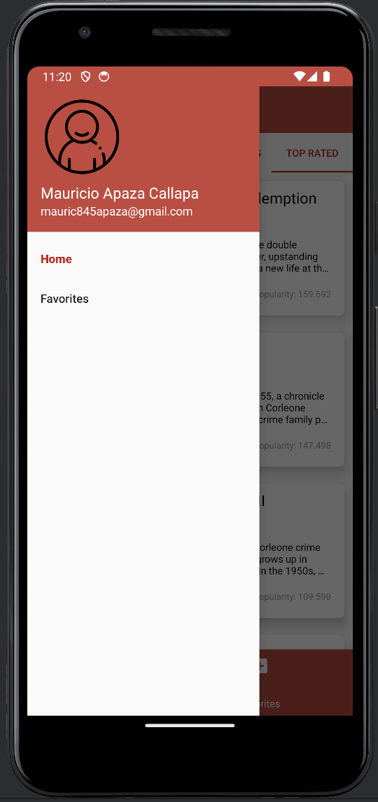
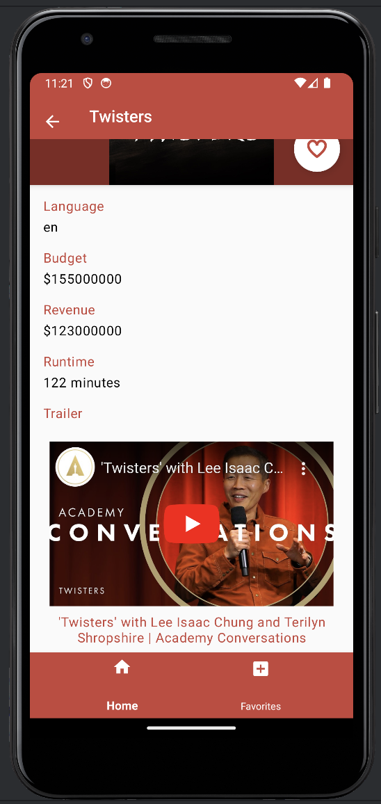
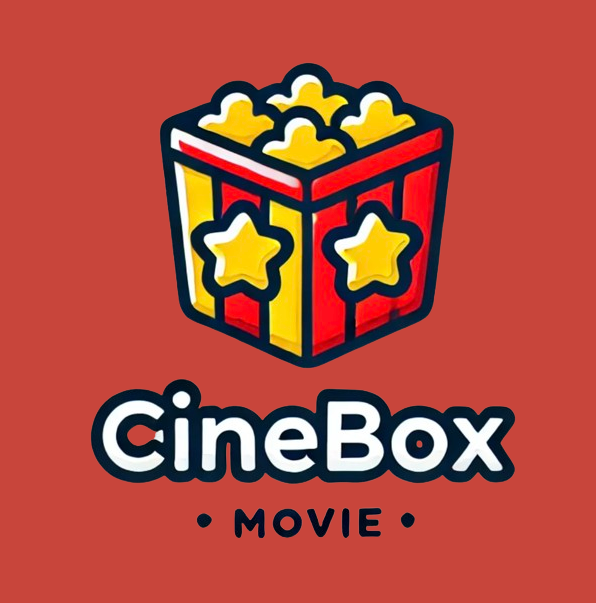

# CineBox
## Hecho por : Mauricio Nestor Apaza Callapa
Nuestra aplicación móvil, desarrollada en Android Studio con Kotlin, está diseñada para ofrecer a los usuarios una experiencia completa y
conveniente al explorar y organizar su contenido cinematográfico favorito. La aplicación consume información de The Movie Database (TMDb) API,
proporcionando acceso a una amplia gama de detalles sobre películas, incluyendo sinopsis, trailers y más.

## Instalación

1. Clona este repositorio: `https://github.com/MauriNestor/AppMobile.git`
2. Abre Android Studio y selecciona "Open an existing project".
3. Navega al directorio donde clonaste el repositorio y selecciona la carpeta del proyecto.
4. Genera tu propia API_KEY en https://www.themoviedb.org
5. Copia y pega en el archivo  `gradle.properties`
```kotlin
  API_KEY = "YOUR API KEY"; 
```
5. Sincroniza las dependencias del proyecto con Gradle `(build.grade.kts)`.


## Características - Prevista


Home|Detalles|Favoritos
:-----:|:-------------------------------:|:-----------:|
|||
Navdrawer|Trailer|Logo
|||


## Tecnologías Utilizadas

- Kotlin
- Android SDK 24
- Retrofit
- JetPack
  - Lifecycle - desechar los datos de observación cuando cambie el estado del ciclo de vida.
  - ViewModel - relacionado con la IU
  - Room Persistence - craecion de la base de datos.
- Arquitectura
  - MVVM (Model-View-ViewModel)
  - Material de diseño
    - OkHttp3 - interceptores para login al consumir endpoint
    - Glide - cargado de imagenes
    - RecyclerViewAdapter - implementado en adapters, IU, viewHolders

